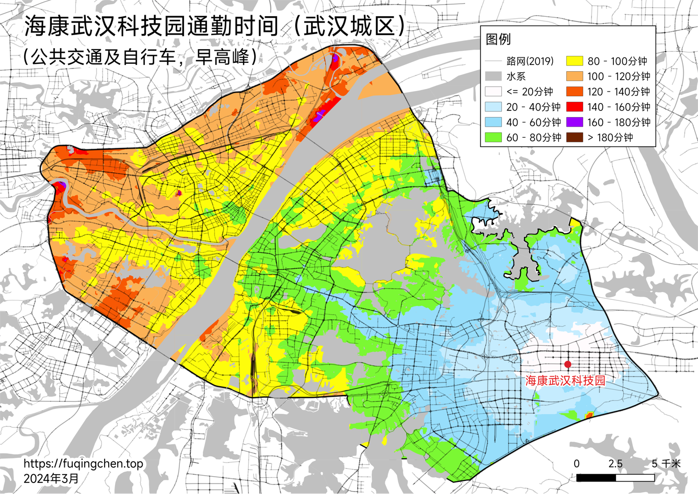

# 个人首套房构想

## 概述

2015年涨价去库存以来，武汉市房价上涨了78%左右，给我们这些武汉「新市民」带来了巨大的压力。这样的话导致一旦买房，储蓄的财富将损失大半，并且背上数倍于当前储蓄的负债，容错率基本为0。

因此买房这件事的重要级别对个人而言是相当高的。下面就是对买房时间、地点的一个框架。

## 时间选择

由于基本上没有容错率，只能All in来付首付，对于个人而言最重要的是需要考虑买房之后的一个风险。毕竟一旦买房背上刚性30年的债务后，很多意外都可能导致家庭经济崩溃。

所以说时间选择上主要参考两个时间：考虑到风险后啥时候才能攒到首付和保险资金（入场时间）、买房后亏的最少的时间（合理时间）。

### 入场时间

其实主要就是刚买房的前几年比较危险，买完房之后需要一定的保险金，后面有储蓄了情况就会好很多。结合目前家庭成员的情况和市场环境，存在的风险主要在两个方面：

- 付完首付款后5年内失业：一般来说需要花费3-6个月重新找到新工作，然后在花3-6个月调整生活方式。因此需要预留家庭1年总消费左右的生活费，这期间买房后新增的房贷肯定是需要不断还的；

- 住院、手术等医疗费用：遇到住院手术什么的医疗事件在所难免。因此需要预留全国三级公立医院次均住院费用6倍左右的资金，约为7.9万元；以及7天ICU花费，约为4.2万元，合计为12.1万元。

> 就个人情况而言，主要是下面这几个时间点比较关键：
> 
> | 年份       | 失业后倒计时（买房后） |
> | ---------- | ---------------------- |
> | 2024年8月  | 1.04年                 |
> | 2025年3月  | 2.04年                 |
> | 2025年10月 | 3.04年                 |

### 合理时间

虽然说刚需买房自住不需要考虑亏多少赚多少，买之前还是可以择时减少损失的，同时武汉的刚需楼盘大多在30层以上，按照现在的建筑质量差不多15-20年后就老化需要置换（根据宜昌市的经验），到时候肯定是需要考虑卖出的

房价的话短期看经济，长期看人口。根据个人研究，目前不需要考虑房价上涨的情况。

（一）经济

高盛在今年根据历史经济数据进行了预测，当前（2024年）差不多从最高点降了一半。

我这边的观点是由于刚需买房主要是通过未来现金流折现（长期贷款）实现，根据未来现金流的情况（收入和就业预期情况）就能知道需求端的情况，而供给端武汉需要41个月消化库存，所以我主要关注两个指标：

- 收入情况：人均可支配收入;住房平均租金
- 就业情况：失业率、企业就业人员周平均工作时间

（二）人口

武汉市统计局每年都会在年末发布统计年鉴，可以对武汉市的户籍人口数进行一个评估，也可以对人口流入进行测算。考虑到刚需人群主要在25-34岁，如果维持当前的人口流入速度，估计差不多在2028年附近会到达一个底部。后续发展需要根据人口数据持续矫正。

> 就个人而言，2026年左右我是比较能接受的，下一次统计数据更新在2024年末，将会持续观察

## 板块选择

买房的时间差不多能够确定了，接下来就算地点了。像刚需就只考虑地段（通勤时间）和房价了

> 等我有了小孩，结合当前的结婚率和生育率及趋势，那时候估计学区概念也不存在了

通勤时间占据了自身的劳动剩余时间，因此这里可以按照时薪的方式叠加到房价上（工作毕竟也是劳动时间换取报酬）

叠加后的等效房价差不多=首付+PV(贷款利率，贷款期数，月供+月通勤时间×时薪)

> `PV()` 是 Excel 中的函数，用于将月供折算成当前的资金

之前调高德地图API画通勤时间的地图，其实作用主要是在这里。如果是两个人的话就需要根据上班时间等等加权平均一下，同时也需要结合工作时间考虑下非高峰期的开车时间

> 等效房价如下表所示（2024年5月贝壳二手房数据）
>
> | 板块       | 当前房价(万元/m²) | 公共交通等效房价(万元/m²) | 开车等效房价(万元/m²) |
> | ---------- | ----------------- | ------------------------- | --------------------- |
> | 白沙洲     | 1.3               | 2.1                       | 2.0                   |
> | 武昌火车站 | 1.5               | 2.2                       | 2.0                   |
> | 街道口     | 1.7               | 2.3                       | 2.2                   |
> | 虎泉       | 2.0               | 2.5                       | 2.5                   |
> | 关山       | 2.0               | 2.5                       | 2.4                   |
> | 光谷东     | 1.8               | 2.0                       | 2.0                   |
## 小区选择

武汉市的新房和二手房价格差别挺大，所以只会选择二手房

考虑到以下几个需求（优先级有高到低），对应的小区就只有个位数，所以小区的选择是非常简单的，具体选择哪个到时候再看了

1. 人车分流
2. 房龄在5年内，或者10年内的万科或者保利物业
3. 容积率在3.5以下，绿化在30%及以上
4. 高层及以下住宅
5. 小区居民整体年龄相近
6. 武汉地铁11号线附近
7. 小区内部存在底商
8. 公共交通/自行车30min内有三甲医院

------

2024/5/4