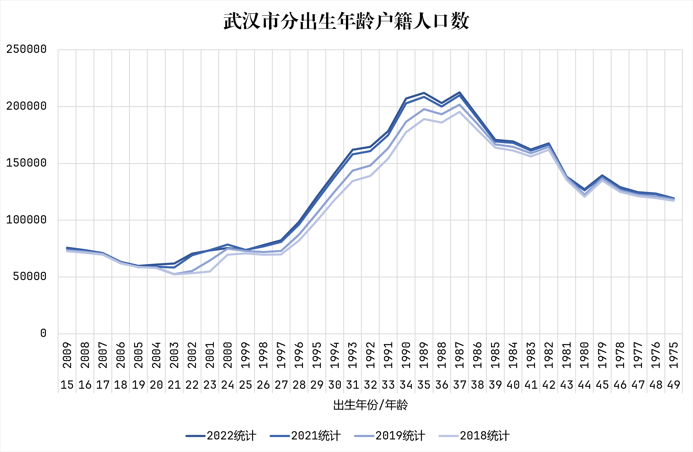
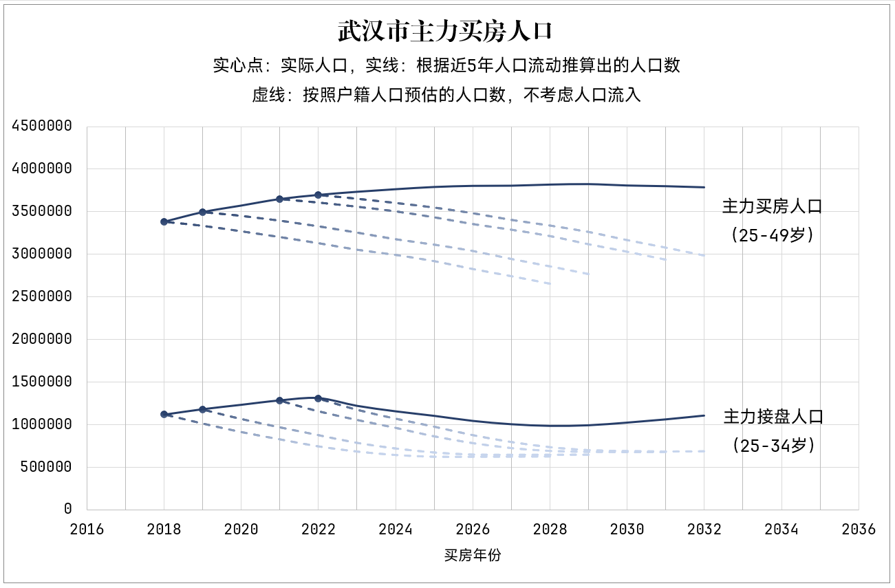

# 一、武汉市买房预期

买房预期主要跟人口（长期影响）、收入预期（短期影响）和居民负债（上限&可持续性）有关。收入预期和居民负债数据仅提供信息来源，不显示数据。

## 总结

无论从长期、短期还是可持续性来看，目前的房价存在少量的上涨空间和大量的下跌空间。

近5年内，武汉市房价预计在 2028 年到达底部，若经济形势有所好转，会提前1-2年到达底部。具体买房时机需要在2024年统计数据发布后决定。

近5年内，无论哪年买房，10年后的接盘人数将会是现在的 70%-80%，买完房后预计会亏损以上金额。可以选择总价较低，或者核心区域的房子减少损失。

## 人口

武汉市作为中部第一城存在大量的人口流入现象，因此购房人口需要考虑到人口的流入

好在统计局每年都会发布每个年龄武汉市的户籍人口（[武汉市统计局 ](https://tjj.wuhan.gov.cn/tjfw/tjnj/)），可以获取到武汉市对应人口的流入情况。2020年由于疫情，数据存在失真，因此我把它去除掉了。

根据上面的数据计算人口增量可以去除生育率的影响，得到人口流入数据，武汉市的人口流入在近5年呈现出逐年递减的趋势

| 年份          | 25-49岁增量 | 25-34岁增量 |
| ------------- | ----------- | ----------- |
| 2019          | 113583      | 62816       |
| 2020-2021平均 | 76993       | 50877       |
| 2022          | 48305       | 26951       |

根据中国房地产协会发布的 [2021新居住消费调查报告](http://admin.fangchan.com/uploadfile/uploadfile/annex/3/2972/6087de9db4eb9.pdf)，武汉市平均购房年龄为30岁左右；根据湖北省民政厅发布的数据显示（[中新网湖北](https://www.hb.chinanews.com.cn/news/2023/0216/387771.html)），2022年湖北省平均初婚年龄为31岁，设定25-34岁为主力买房接盘（刚需）人群；考虑到改善型住房的需求增加，主力买房人群扩大到25-49岁这个年龄段。

根据统计局的年龄人口数据和推算出的人口流动数据，取近5年人口流入均值作为后续的人口流入数，可以绘制出主力买房人口的数据。实线为乐观估计，虚线为悲观估计。

**从人口方面查看，近期内武汉依靠强大的人口流入效应依然能够维持一个比较稳定的买房人口，预计本轮房价下降后将会维持在一个均值附近。**

**但是人口流入能否保持依然需要观察，根据人口情况买完后10年房价会出现大幅下跌的情况，应该降低预算，留足现金流。后续应该及时卖出。**

## 收入预期

收入预期可以通过房租价格（租房平台）、青年失业率和平均工作时间（国家统计局）相互佐证

**总体来说全国层面收入预期存在下降，武汉市整体稳定，略有下降。**

## 居民负债

目前居民债务收入比约在137.9%，杠杆率稳定在60-70%（60%为社科院数据，70%为央行数据）。

**整体居民负债处于不可持续的水平，但依然存在30%左右的上涨空间。**
