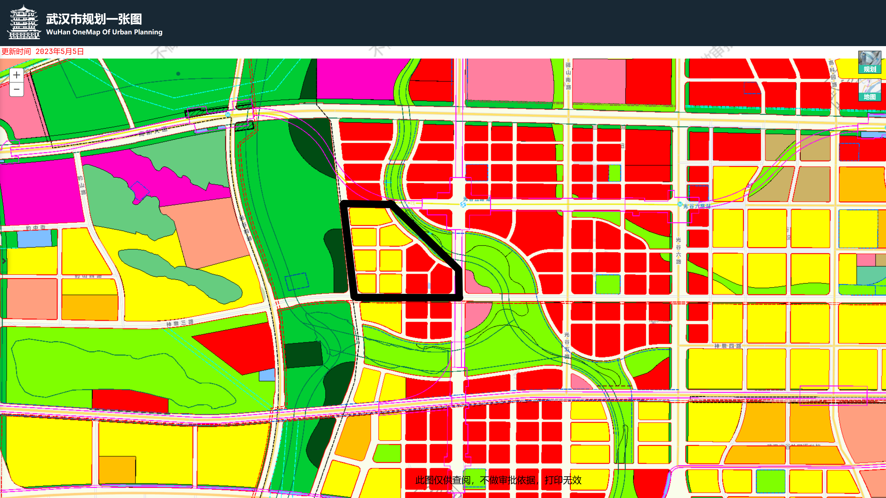
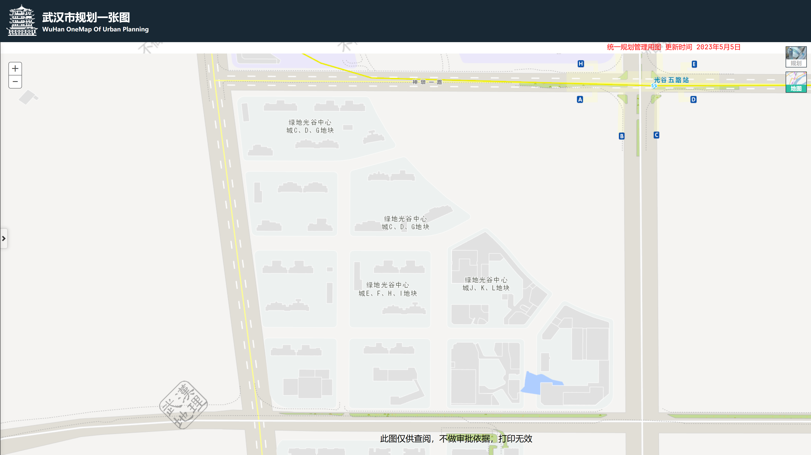

# 四、小区环境情况调查模板

## 考虑因素

1. 小区的位置：仔细观察小区的位置，看它是否靠近市中心、商业区、学校、医疗设施等。了解周围的基础设施和便利设施是否满足你的需求。
2. 周边环境：观察小区周围的环境，包括道路状况、绿化情况和噪音水平。注意是否有附近的工厂、垃圾填埋场或其他可能影响居住环境的因素。
3. 房屋状况：如果你打算购买二手房，那么房屋的状况就非常重要。仔细检查房屋的结构、外墙、屋顶、门窗等，看是否存在裂缝、漏水或其他损坏情况。此外，了解房屋的维护记录和任何装修或翻新工作的情况。
4. 设施和配套：了解小区内的设施和配套设施，如停车位、儿童游乐区、健身房、游泳池、保安系统等。这些设施可以提升居住体验，也会影响房屋的价值。
5. 物业管理：询问小区的物业管理情况，包括费用、服务质量和管理规章制度。一个好的物业管理可以保证小区的良好维护和管理，提供舒适的生活环境。
6. 交通便利性：考虑小区的交通便利性，包括公共交通站点的距离、附近道路的状况以及是否有便捷的出行方式。良好的交通连接可以方便你的日常生活和工作。
7. 小区的发展潜力：了解小区的发展潜力和前景。你可以查看周边的规划和开发计划，以及附近区域的发展趋势。这可以影响未来房屋价值的增长潜力。
8. 邻里关系：与周围居民交流，了解小区的邻里关系和社区氛围。友好的邻里关系可以提供更愉快的居住体验。

## 考察指标

| 项目     | 内容            | 备注 |
| -------- | --------------- | ---- |
| 小区名称 | 绿地光谷中心城  |      |
| 建成时间 | 2020年          |      |
| 动工时间 |                 |      |
| 容积率   | 3.05            |      |
| 停车位   | 2874（1：1.67） |      |

### 周边环境

| 项目       | 内容 | 备注 |
| ---------- | ---- | ---- |
| 道路状况   |      |      |
| 小区外噪声 |      |      |
| 小区内噪声 |      |      |
| 中介数量   |      |      |
| 监控情况   |      |      |

### 小区环境

| 项目             | 内容 | 备注 |
| ---------------- | ---- | ---- |
| 人车分流         |      |      |
| 停车场           |      |      |
| 小区运动设施     |      |      |
| 垃圾桶管理情况   |      |      |
| 道路情况         |      |      |
| 小区大门完好程度 |      |      |
| 保安态度         |      |      |
| 园林维护情况     |      |      |
| 晾晒区           |      |      |
| 网络和通信覆盖   |      |      |
| 网络和通信覆盖   |      |      |

### 室内状况

| 项目           | 内容 | 备注 |
| -------------- | ---- | ---- |
| 室内噪声       |      |      |
| 楼道杂物       |      |      |
| 电梯情况       |      |      |
| 网络和通信覆盖 |      |      |

### 地理位置

