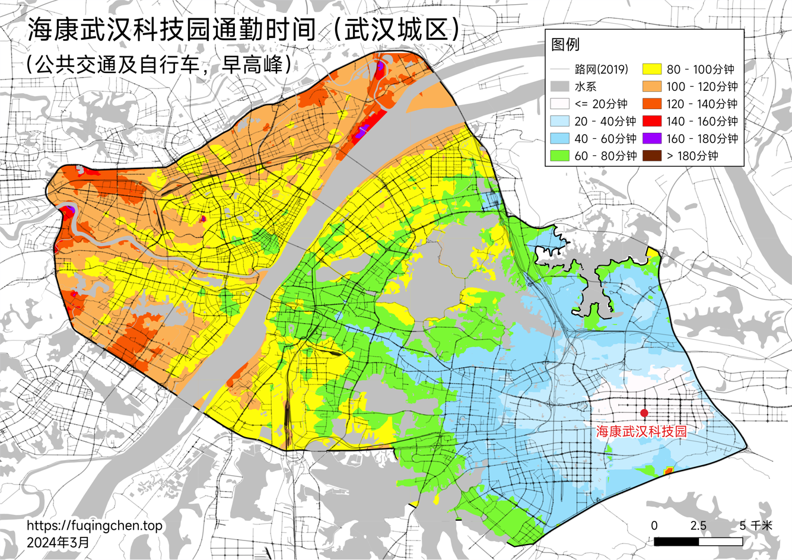

# 五、武汉地理研究

## 到医院的距离耗时

### 三甲医院

#### 驾车

#### 公共交通

#### 步行

### 社区医院

#### 驾车

#### 公共交通

#### 步行

## 到公司的距离耗时

数据来源：高德地图

### 驾车

### 公共交通

### 步行

## 下雨积水深度

## 到公园的距离耗时

### 驾车

### 公共交通

### 步行

## 人口密度分布

数据来源：[2023年度中国主要城市通勤监测报告 (bcebos.com)](https://bj.bcebos.com/v1/mapopen/cms/report/2023tongqin/index.html)

