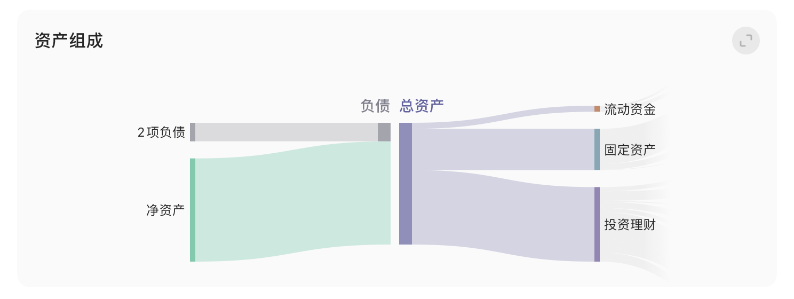
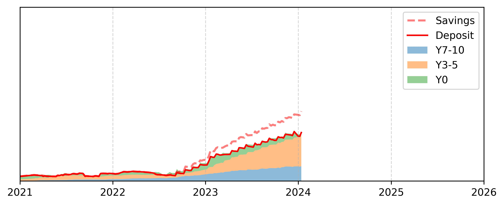
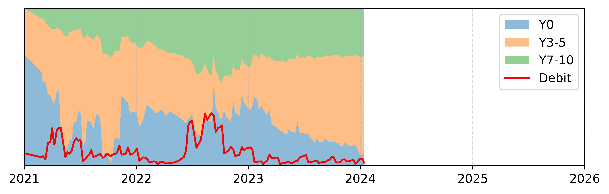
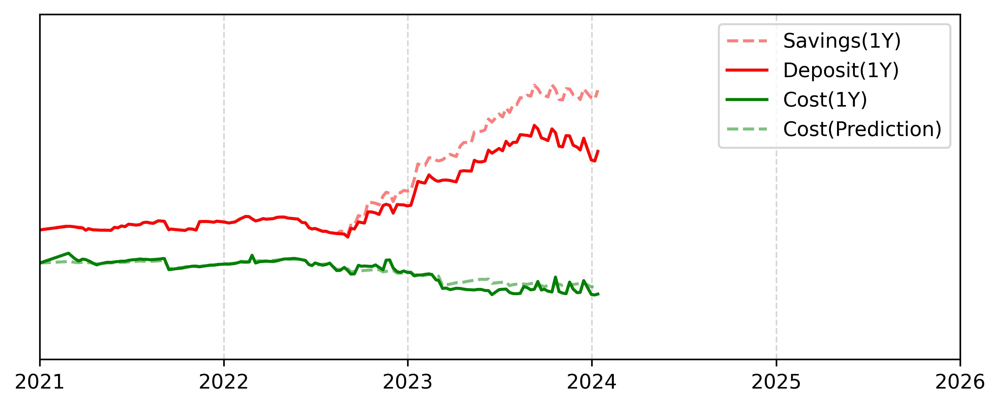
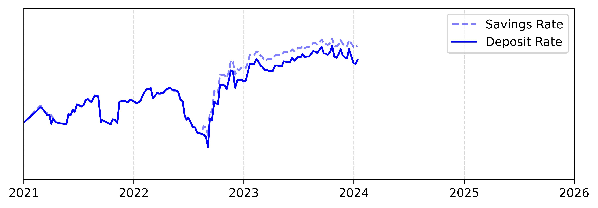

# 个人资产情况

## 资产组成

## 资产趋势

这个板块记录目前攒的钱。由于光统计到手的工资比较吃亏，我把公积金账户什么的也统计了下，用虚线标出。

上面的图中目前攒的钱我分成了三大块，这是因为我把手头上的资金按照流动性进行了划分。投资7-10年的长期投资用Y7-10表示；3-5年的中期投资我用Y3-5表示；其他的都是活钱，用Y0表示。这三个加一起再加上负债就是总资金了。

## 存款结构

资金总量这个板块我把资金按照流动性进行了划分，这里就是它们的一个占比情况

- Y7-10：7-10年的长期投资，主要投资股票类的指数基金和主动基金，例如中证红利
- Y3-5：3-5年的中期投资，主要投资债券类基金，例如国开债指数基金
- Y0：现金，主要存在银行卡、余额宝

## 收入支出

这个板块表示近一年存的钱和花的钱，不足一年的折算到一年。绿线是存的钱，虚线是加了公积金、医保账户的；红线是近一年的开销，虚线是我设计的一个预测值，表示近几个月的花费，折算到一年。

## 储蓄情况

储蓄率是一个比较重要的指标，表示能存到多少钱，这是近一年的储蓄率，不足一年的折算到一年。虚线是加了公积金的储蓄率。

