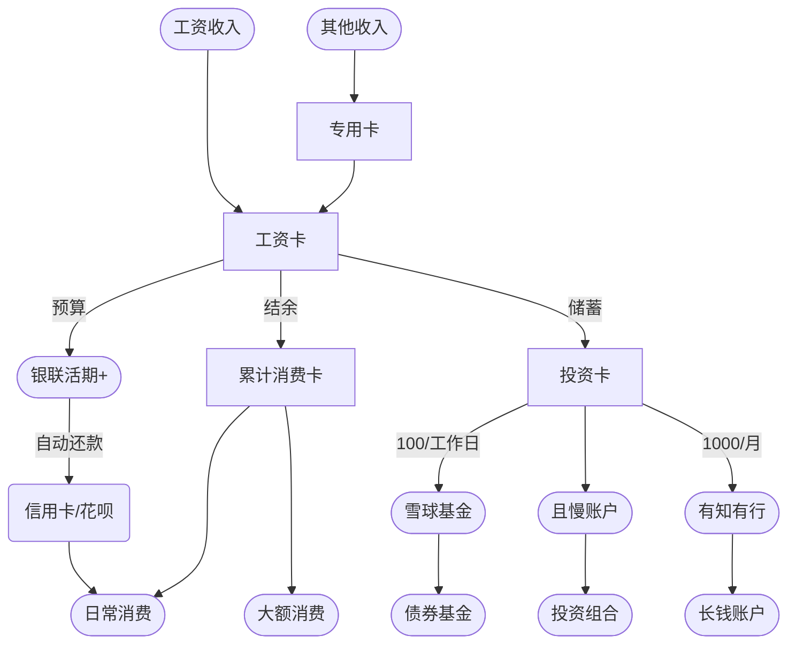
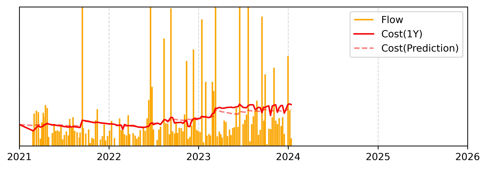
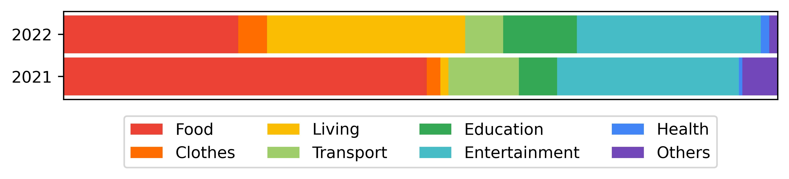

# 个人资产管理

## 收入管理

??? 示例

    | 到手收入 | 日常消费 | 债券基金 | 投资组合 | 长钱账户 |
    | -------- | -------- | -------- | -------- | -------- |
    | 20000    | 4166.67  | 2175     | 12658.33 | 1000   |
    | 19000    | 4166.67  | 2175     | 11658.33 | 1000   |
    | 18000    | 4166.67  | 2175     | 10658.33 | 1000   |
    | 17000    | 4166.67  | 2175     | 9658.33  | 1000   |
    | 16000    | 4166.67  | 2175     | 8658.33  | 1000   |
    | 15000    | 4166.67  | 2175     | 7658.33  | 1000   |
    | 14000    | 4166.67  | 2175     | 6658.33  | 1000   |
    | 13000    | 4166.67  | 2175     | 5658.33  | 1000   |
    | 12000    | 4166.67  | 2175     | 4658.33  | 1000   |
    | 11000    | 4166.67  | 2175     | 3658.33  | 1000   |
    | 10000    | 4166.67  | 2175     | 2658.33  | 1000   |

## 消费管理

### 流水

每周统计一次的花费流水

### 分类

消费分布

## 投资理财

| 年份     | 收益率     | 通货膨胀   |
| -------- | ---------- | ---------- |
| **2023** | **-0.01%** | **+1.10%** |
| 2022     | -5.52%     | -1.41%     |
| 2021     | +2.36%     | -0.21%     |

.JPG)
