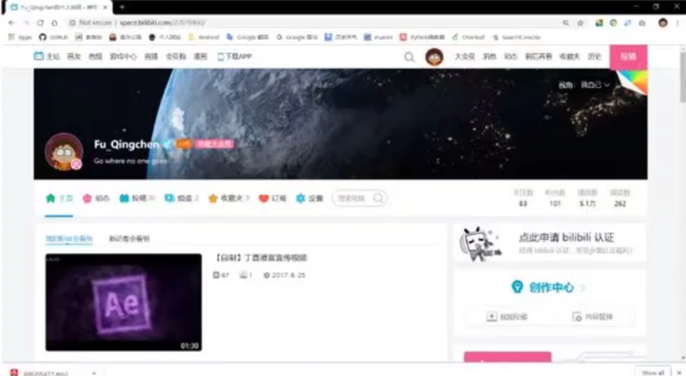
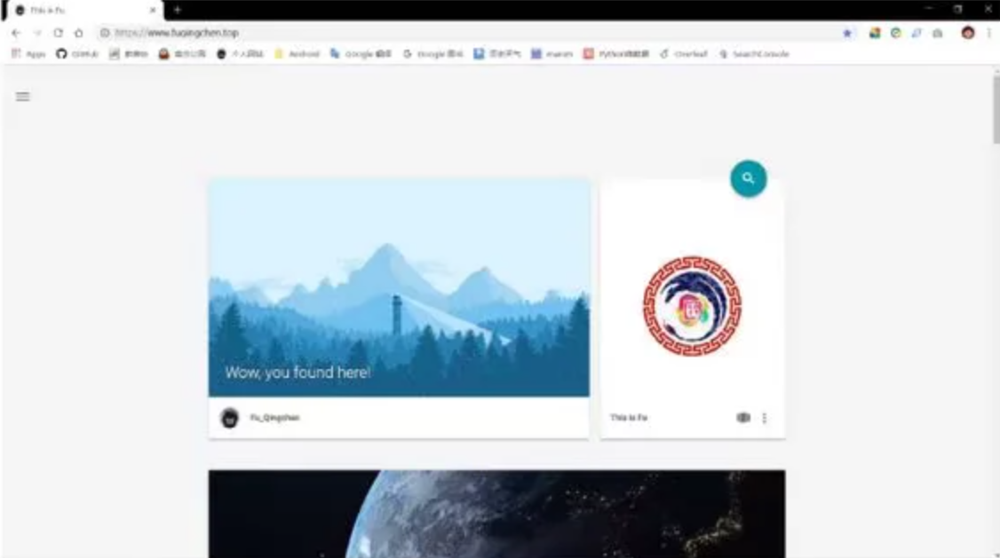
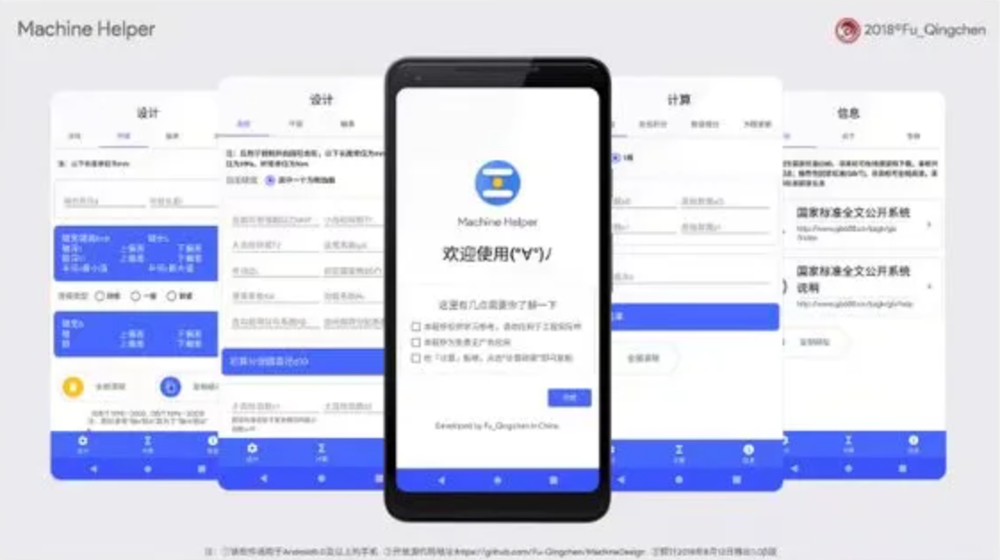
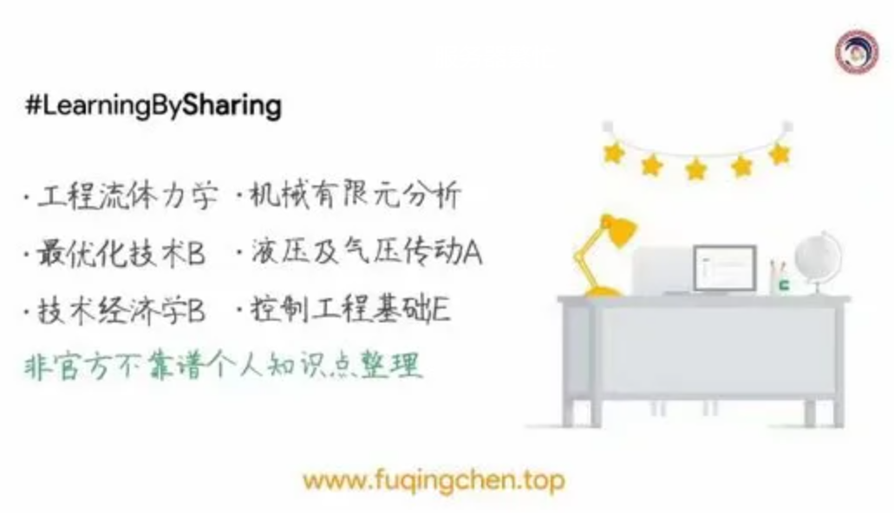
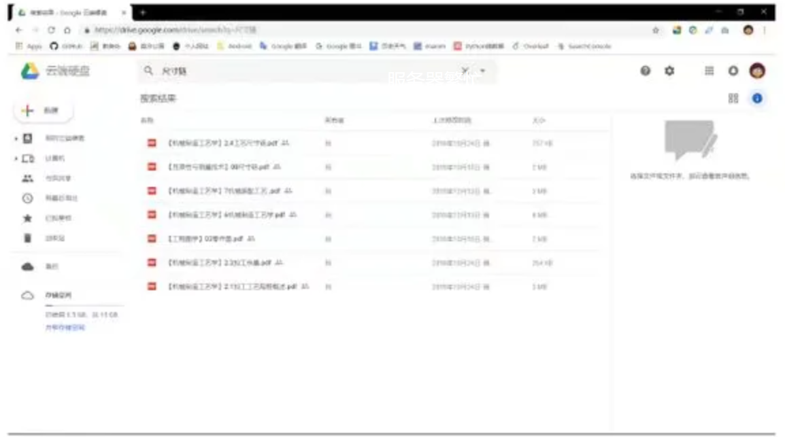

# 2018年度报告

2018©Fu_Qingchen，数据截止：2018-12-30 19:50:40

## 综述

2018年的关键词是编程。总的来说2018年稳步前进，严格按照年初的计划执行，同时获得了很多关键性成果

## 购物相关

### 最佳购物

|       名称        |  单价   |                    备注                    |
| :---------------: | :-----: | :----------------------------------------: |
| Google Pixel 32GB | 1480.00 | 虽然降价了很多，但是真的好用，目前主力手机 |
|   小米活塞耳机    |  29.00  |                  便宜实惠                  |
|    平板触控笔     |  2.51   |       虽然是最便宜的笔，但是真的好用       |
|     iPad2018      | 2367.00 |        目前性价比最高的平板，很好用        |
|   Good Notes 4    |  3.88   | 很好的平板笔记应用，对垃圾手写笔兼容性最好 |

### 最差购物

|        名称         | 金额  |            备注            |
| :-----------------: | :---: | :------------------------: |
|    Github 马克杯    | 39.00 | 这是我见过最容易碎的杯子了 |
|     小米驱蚊器      | 79.00 |            没用            |
|  iPad钢化膜-标准版  | 26.80 |     不防指纹，用一次擦     |
|      饥荒 iOS       | 20.00 |    优化差，还比电脑版贵    |
| 机械制造工艺学课本  | 43.10 |   贵&没用，还没习题答案    |
| 武汉通(小米手环3版) |  100  |    支付宝可以替换还便宜    |
|   肥仔快乐保温杯    | 26.6  |            漏水            |

## 视频

这块基本算废了。。。

### 武汉理工大学毕业季MV

很有意思的一次社团工作，我在里面一开始担任是后期指导，后来负责余家头校区的剧务以及整个团队的财务工作，这次认识到了很多大佬，然后了解到了拍片子的不容易，尤其是在一个团队里面，各种统筹规划（还好大多不是我的事情）最终效果很棒~

### Bilibili

这个属于啃老本了，今年更新视频特别少，主要是没时间也没精力做这些了，最近在钻研学术动画的制作。2019 年要研究一下 $Manim$ 这个数学动画引擎。

哦，对了，还做了一张壁纸，用 AE 做出了来的就是上面那个

## 编程相关

成果很多

### 个人网站

2017年期末试行，然后发现自己成绩提高了，而且可以让别人受益，就继续办下去了。2018年1月正式购买域名、建站，从原来的只支持标准 Markdown，到套用了主题，再到 $\LaTeX$ 公式的支持 ，历经几个版本的更新，目前已经形成一套成熟快捷的系统，采用 Google Material Design 主题， 通过 Markdown 实现快速建立页面，用 $\LaTeX$ 编译公式。目前已有25篇文章，应该很多人看过。

### Machine Helper

Machine Helper 是暑假闲着无聊，弄的一个安卓应用程序，采用 Google Material Design 设计，历时 3 周制作完成，目前处于完善阶段，这是我编程方面第一次正规的尝试，在里面也获得了很多编程技巧，比如面对对象编程，断点的应用等等。内含齿轮的设计计算、平键的设计计算、轴承的寿命计算；线性插值，数值积分，数值微分，方程求解；国标指引总共8个功能。后期打算加入自定义公式、公差查询等功能。

### 开源

去年开始的 #LearningBy**Sharing** 得到了全面贯彻，不过由于时间关系图中凉凉了几个。。。有些遗憾，还是执行力不够。

## 工作流

今年始终贯彻电子化与数字化的概念，能用电子版的就用电子版。建立了以 iPad 和 Google 服务为中心的工作流，以及以 Github 和 坚果云 为核心的自动保存体系

今年做的一项特别的是对课件进行了整合，建立起来了一套课件体系。这样当我忘记了就可以对其关键词进行搜索，快速找到相应的课件

选择 Google Drive 的原因是界面美观而且支持真正的全局搜索

## For 2019

2019的关键词是 **实践** ，主要的挑战来源于 考研/保研，同时要注意把之前的知识建立起一套知识体系出来，还有英语也很重要，要开始背单词了。

------

以上就是我 2018 年做的所有无聊的事情了，感觉还挺丰富的