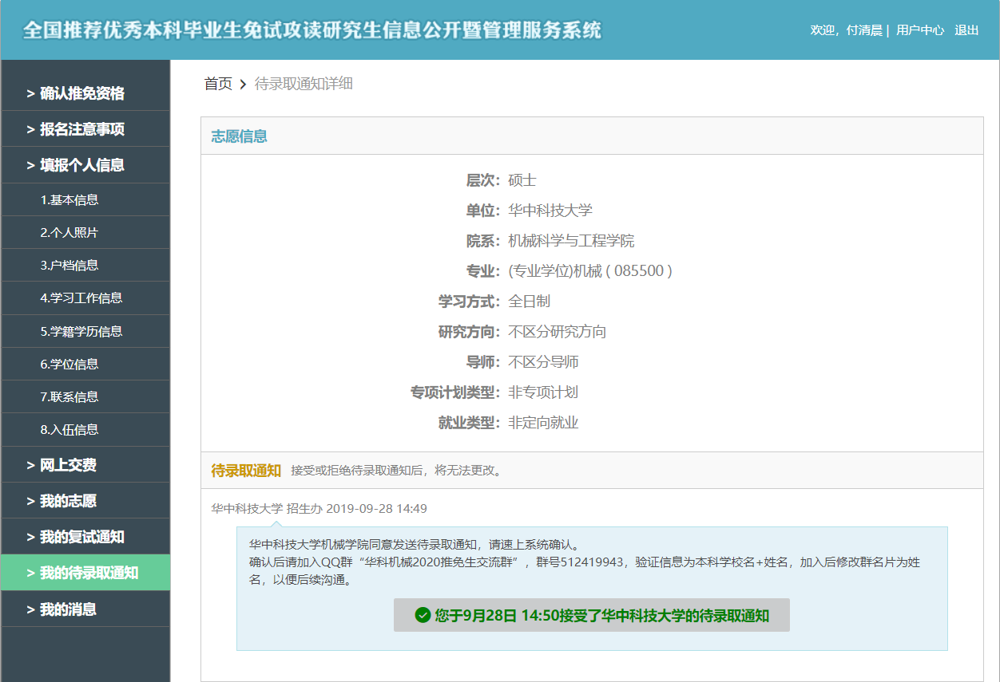
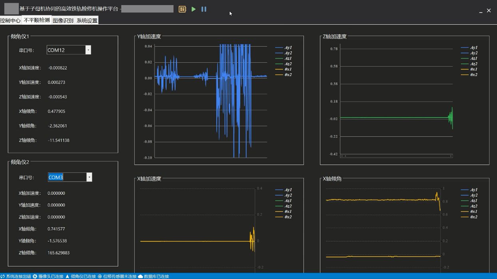
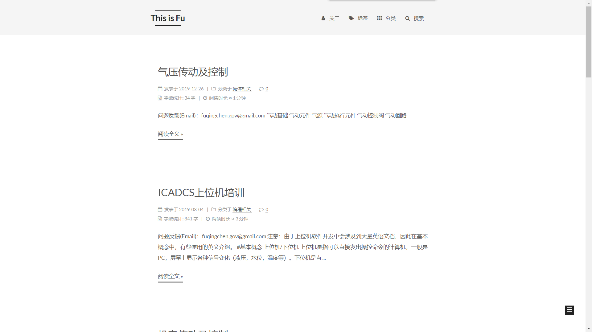
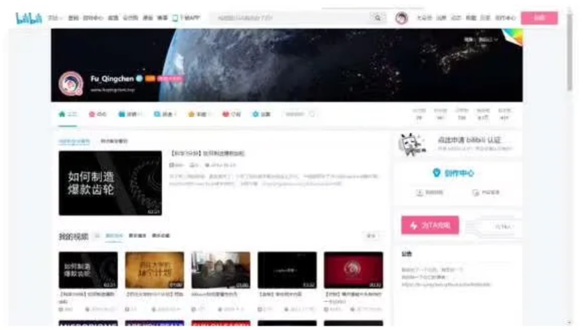
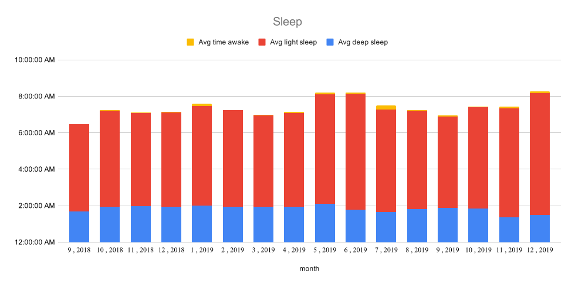
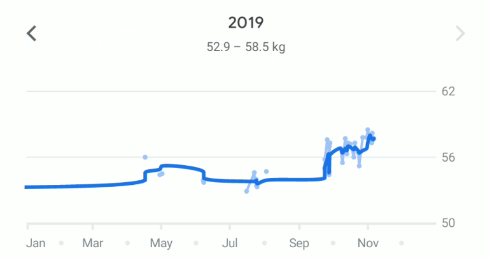

# 2019年度报告

2019©Fu_Qingchen, 数据截止：2019-12-31 4:58:50

## 综述

2019年的关键词是 **机遇** 。整个2019年充满了各种不确定性，很多时候生活被更重要的事情打断，很多时候是走一步算一步，不过还算幸运都一步步走过来了，迎接的是美好的未来。

## 学业

### 升学

今年升学对不善言辞的我来说是一个巨大的挑战，自己非常幸运的来到了华科CAD中心王老师门下，特别感谢一路走来帮助的那些人。

### #LearningBy**Sharing** 

今年继续实行#LearningBy**Sharing** ，对不少科目的笔记进行了公开，不过出现了一些问题。首先是今年发现思维导图比知识点整理效果更好，于是放弃了知识点整理，但是思维导图分享出去看起来乱七八糟，效果并不好。二来是自己懒了。

## 编程相关

### 挑战杯上位机

为挑战杯比赛开发了一个软件操控程序。程序思路挺简单的，就是把传感器的数据读取出来，然后处理一下。C#编程跟 Java 很相似，不过边学边做，还是花了5个月来完成。中途遇到了各种各样的问题，比如说串口数据的读取，图表的绘制，然后是数据库的搭建，串口堵塞等等。

作为我的第一个团体项目，特别感谢指导老师和队员们对我的支持和理解，使得最后以各种方式解决了大部分问题，还申请了一个软著。

这应该是我编程方面第二次比较正式的尝试，虽然说有各种各样的问题，还有很多可以改善的地方，不过整体来说还算是比较满意的。

### 个人网站

www.fuqingchen.top 

自2017年以来个人网站已经比较完善了，今年更新的比较少，不过也进行了一些更新：换了一个主题更加简洁高效，然后新增了评论系统和搜索系统，另外还加入了字数统计，还有一点就是把网站从Github转移到了码云，速度变快了一些。

今年个人网站的也变的不太实用。我分析了下主要是下面一些原因：课程变少，同时专业分流让受众变少，另外由于有各种事情，自己专业课也没有以前那么扎实，也不太敢分享了。于是乎 #LearningBy**Sharing** 没有之前响了。

未来，个人网站的主要作用有两个。一是记录和分享个人的学习笔记和心得啥的，二来是当作一个数据库，汇总一些好玩的实用的资源，方便查找，如果有啥忘记的直接在网站上搜。

## 视频相关

2019年B站共发布2个视频，累计时长4分钟，《【科学3分钟】如何制造爆款齿轮》获得了最高播放量。

2019年间歇性制作视频。上半年参与挑战杯比赛，制作了若干视频（这个视频反反复复改了十几遍，真是心累）。下半年参加哔哩哔哩和中科院举办的科普视频比赛，制作了一个介绍齿轮的视频，效果还可以。

今年制作的视频制作方式发生了改变，由视频软件转向通过高级语言编程实现，例如那个介绍齿轮的视频有60%使用 Python 动画库 **Manim** 完成。

2019年开学时曾经拟过《抓住大学的18个计划》系列视频计划，但是由于制作时间成本过高导致计划泡汤。

#### 最佳消费

|              名称              | 单价 |             备注             |
| :----------------------------: | :--: | :--------------------------: |
|        树莓派4B 2G套件         | 409  | 便宜。目前当做一个小电脑在用 |
| Introduction to Linear Algebra |  70  |    这本线性代数讲的很到位    |
|         长城21寸显示屏         | 299  |     便宜，而且竖屏很舒服     |
|         TESTV牛扎奶芙&怪味胡豆         |  19.8  |       好吃       |
|         Bilibili大会员         |  98  |       免费看了很多电影       |

#### 最差消费

|        名称        | 单价  |        备注        |
| :----------------: | :---: | :----------------: |
|  小米米家电动牙刷  |  154  |     麻，用不了     |
|    相机帽子配件    | 21.47 |    带着很不舒服    |
| 现代气动元件与系统 |  38   | 之后一直用的电子书 |

## 健康

### 睡眠 [中等]

平均睡眠时间为 7: 26 ，需要补充随眠时间和随眠质量，但较上年有所好转

### 体重 [良好]

2019年成功让自己的体重处于正常水平，达到了 58.5kg

## For 2020

希望2020顺利的度过从本科生到研究生的过渡阶段，进一步明确今后的方向。然后把英语补回来，再把驾照拿了。信息时代再补点计算机的知识。