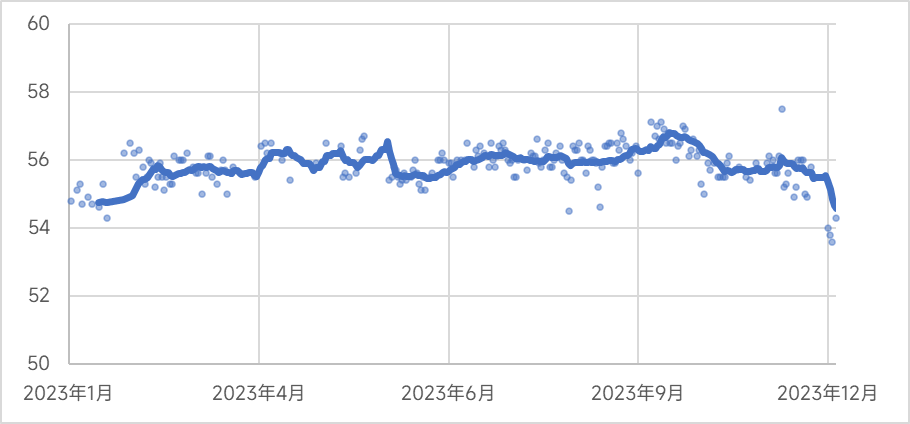
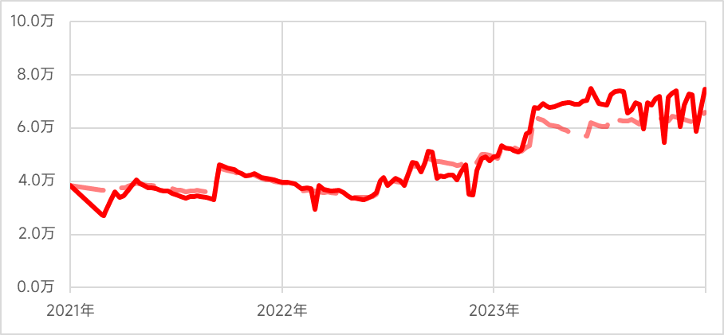
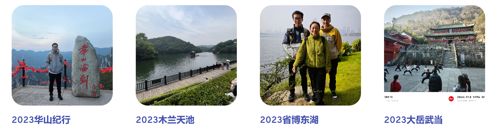
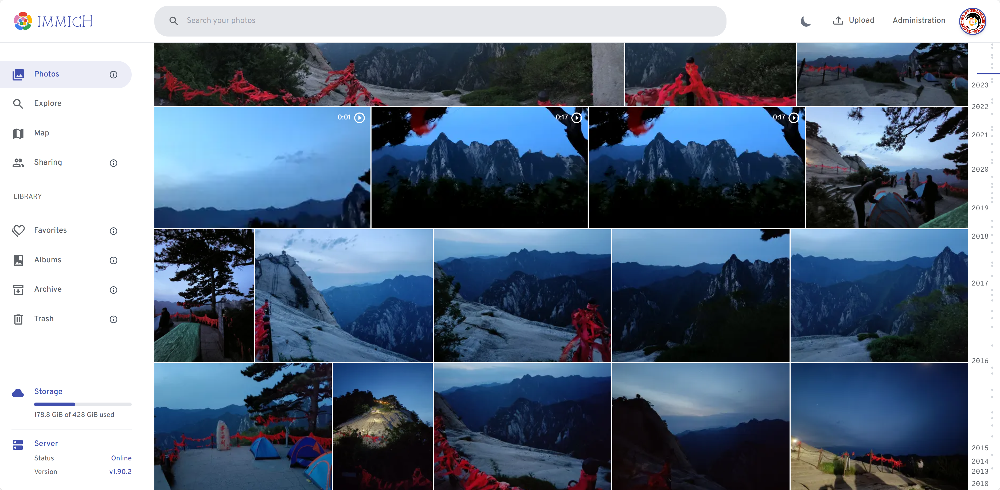

# 2023年度报告

数据截止：2023-12-31 23:59:59

## 〇、关键词

2023年可以说是「峰回路转」的一年

上半年的状态很差，外部经济就业形势持续恶化，人工智能的发展又大大超出预期，整个人都处于一个紧张焦虑的状态。为了缓解自身情绪，当时选择了躺平摆烂的方式，现在看来陷入恶性循环了（可以说是消失的半年）

下半年进行了调整，整体状态有了比较大的改善，至少心态上放的很平。同时受到同事的影响，开始关注个人身体健康，尝试了登山、游泳、骑行等多种运动方式，还把不少老毛病（肠胃和智齿）处理了下

## 一、健康生活

今年是真正意义上把健康生活放在首位的一年。总体而言，虽然感染了新冠有了debuff，但是身体素质并没有发生什么大的变化。对于2024年，维持「2023中期回顾」中的内容就可以了

### 1.1 医疗

本年度只发烧了2次，分别是5月底的新冠和12月底的不明病毒性感染，是2022年的一半，但是发烧的持续时间增加了，差不多每次3-4天才能退烧

今年终于把肠胃和智齿处理了一下，导致医疗支出非常高，不过还好有国家医保和公司商业保险，各报销了一半

|    项目    | 消费金额 | 个人自费 |
| :--------: | :------: | :------: |
|    肠胃    | 2158.42  | 1037.64  |
|    牙齿    | 2514.50  | 1046.92  |
|    发烧    | 1270.04  |  77.22   |
| 2023年汇总 | 6382.50  | 2330.87  |

2024年还有2颗智齿要拔

### 1.2 体重

体重方面本来有所增加的，但是后期开始运动，外加年底一次拔智齿，一次为期5天的发烧吃不好又降回来了

### 1.3 活动

- 睡眠：全年日均睡眠6小时58分钟，深睡时间相较于去年减少了。整体还算是比较正常，但最近的生物钟太阴间了，早上差不多6:40就醒了，2024年要逐步调整生物钟，争取达到8小时睡眠
- 锻炼：全年日均锻炼时长为41分钟，近段时间为61分钟，受益于这段时间走路上下班，每天差不多步行3km的样子；另外同事、同学带着我运动的次数也挺多，增加了游泳、骑行等运动方式

> PS：华为这生态太封闭了数据不好导出

## 二、经济生活

前几年对经济看太重了，目前来看成了个人束缚。2024年将会逐步放开消费限制，放宽心态

### 2.1 消费

2023年的消费支出达到74765.55元，今年的大额消费主要包括

| 消费项目       | 支付金额 | 评价                                     |
| -------------- | -------: | :--------------------------------------: |
| 消费电子支出汇总 | 约14000.00 | 换了手机，电脑，手表和运动相机 |
| 旅游支出汇总 | 约2500.00 | 体验相当好，就是有些费人 |
| 医疗支出汇总 | 3977.01 | 算是意外支出了 |
| 麦当劳消费汇总     | 1888.00  | 现在有些吃腻了 |
| 2023年汇总 | 74765.55 | 今年的数据属于比较正常的了 |

近几年的年均消费如下图，目前已经趋于稳定

### 2.2 投资

没亏没赚，白忙活了

| 时间   | 收益率 |
| ------ | ------ |
| 2021年 | 2.36%  |
| 2022年 | -5.52% |
| 2023年 | -0.01% |

## 三、业余生活

2023年还是干了挺多事的

### 3.1 考取驾照

赶上了末班车，到期前一个月拿到了C2的驾照，之前19年在学校练车还是太费时间了，社会上几天就可以练好约考。

### 3.2 旅游纪行

2023年开始恢复旅游了

- 西岳华山：和同事进行的一场特种兵式旅行，绝对是2023年最难忘的经历，爬了一半就被华山征服了，最后爬了两座山，还好有同事看着，缓了一周才恢复。（Ps：华山那落差坐索道都挺吓人的）
- 木兰天池：公司团建，当天还出现了天文现象，总的来说跟宜昌的景区大差不差，体验挺不错的
- 省博东湖：父母来武汉访问，带着他们逛了湖北省博物馆，第二天到东湖骑行
- 大岳武当：2023年的最后一个假期，和同学成功错过了动车，但是最终历经千辛万苦来到武当金顶，向祖师爷拜了一拜

### 3.3 相册迁移

之前照片存在各种网盘上，非常混乱。因此需要将这些照片全下载下来去个重什么的。本次相册迁移涉及QQ空间、Google相册、阿里云盘、小米云盘和中国移动云盘，最终去重后保留了2008年至今的约9000张照片和视频

去重之后选择了开源相册服务进行照片托管 [immich-app](https://github.com/immich-app/immich) 目前来说还是挺满意的，拥有人脸识别、图片识别和热力图功能，能达到Google相册70%的效果

### 3.4 个人网站

本来打算去年恢复个人网站的，但是鸽了。2023年终于重新拾起来了，这次更换成了阿里云的服务器，还进行了工信部和公安部的备案，总的来说更加正规了。目前个人网站的主要目的目前从分享资料变成了提高表达能力

[轻尘风物集 (https://fuqingchen.top)](https://fuqingchen.top/)

### 3.5 年度规划

- 换租：保利时代的租期将在2月21日到期，计划更换到正荣紫阙台，享受下政府的补贴
- 健康：学习下 [中国居民膳食指南 ](http://dg.cnsoc.org/)
- 人工智能：做相册迁移的时候发现AI领域有他们自己的Github：[Hugging Face](https://huggingface.co/)，这不得看下这么用
- 服务器：2023年搭建了个人网站和相册应用，2024年在此基础上探索不同平台文件和数据的自动同步、自动备份和密码管理，搭建个人知识库
- 数据库相关基础：这块之前就没怎么看，补充下基础知识，查缺补漏
- 游戏：赛博朋克2077

------

2024/1/6，https://www.fuqingchen.top